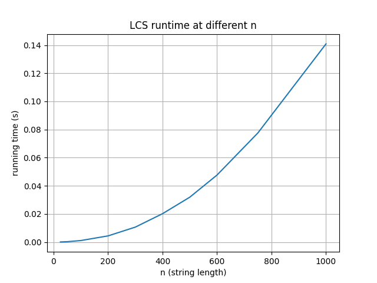

# Programming Assignment 3: Highest Value Longest Common Sequence

**Faris Mussulman - 41342080**

## Build Instructions

No compilation required. Requires **Python 3**.

## Running the Program

```bash
python3 src/lcs.py <input_file>
```

**Example input:**
```bash
python3 src/lcs.py input/examples/example.in
```

**Example output:**
```
88
bcababcababcababcbd
```

## Assumptions

**Input format:**

```
K
x1 v1
x2 v2
...
xK vK
A
B
```

- K is the number of characters in the alphabet.
- Each of the next K lines contains a character and its value.
- A is the first string.
- B is the second string.

## Benchmark

**The benchmark depends on Matplotlib to create graphs:**
```bash
pip install -r requirements.txt
python3 src/benchmark.py
```

**Benchmark Results**



The graph shows a polynomial curve, which is consistent with the expected runtime.

## Written Component

Written component answers are provided in `Programming Assignment 3: Highest Value Longest Common Sequence Report.pdf`
